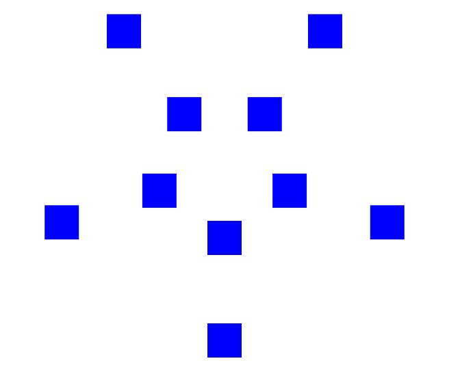

# Space Invaders (Racket)

A simple **Space Invaders clone** built in [Racket](https://download.racket-lang.org/) as part of the *Systematic Program Design* learning journey.  
This project demonstrates functional design, data-driven programming, and interactive game loops.

---

## Features
- Player that moves left and right with arrow keys.
- Missiles fired with the **spacebar**.
- Invaders that can be destroyed by missiles.
- Collision detection between missiles and invaders.
- Structured using *Systematic Program Design* principles.

---

## How to Run

### Option 1: From Source (requires Racket)
1. Install [Racket](https://download.racket-lang.org/).
2. Clone this repository:
   ```bash
   git clone https://github.com/YOUR-USERNAME/space-invaders.git
   cd space-invaders
3. Run the game:
   ```racket space-invaders.rkt```

### Option 2: Download Executable (no Racket needed)
1. Go to the [Releases](https://github.com/WhiteboardNewbie/Space-Invaders/releases) page and download the latest version for your platform.

2. Extract the .zip and run the included executable (space-invaders.exe on Windows).

---

## Notable Design/Logical Principles Used

Since this is a learning project, a lot of the design may seem convoluted and overkill. This is intentional for practice purposes. 
1. For instance, graphs are used to create the waypoints of the invaders, which form a double pentagon as shown.

The invaders move (teleport currently,) along these points at random by traversing through the graph. 
2. Secondly, count-based generative recursion is used to generate the background for the game. Iterating through the count adds additional squares. The two colours are generated independently and then superimposed to create a staggered diagonal offset.

3. Thirdly, the use of precise data definitions and function templates really showcased how powerful these principles are. For instance, the definition for the definition for an **Invader** is it's coordinates and it's waypoint graph - complex data. The function **next-invaders-and-missiles** operates on the **ListofInvader** and **ListofMissile** in the current tick and produces the ones for the next tick, by causing movement and filtering any colliding entities. The following composition tree showcases how the use of natural helpers allowed a smooth implementation of it, which otherwise would be quite convoluted (due to all the tasks involved).
   ```
   next-invaders-and-missiles
   │
   ├── move-invaders
   │   └── move-invader
   │       └── next-waypoint
   │           └── get-random-waypoint
   │
   └── filter-invaders-and-missiles
      ├── collision?       ; checks Invader × Missile overlap
      ├── collision-result ; removes missile if it hits invader
      └── recursive call on rest of invaders
   ```
4. Moreover, comprehensive unit-testing has been done for nearly all functions involved, with it often pointing out to flaws in the logic! The following command runs the tests, but note that some tests are dependent on definitions of constants and so might break once those definitions are changed (because the test result has to be exact). Such tests are indicated in the code.

   ```raco test space-invaders.rkt```
5. The most logically complicated function is the filtering upon collision mechanism for the invaders and missiles. It took multiple tries to get completely right but if I had followed the decipe recipe more closely it would've been easier. Here's the function for reference.
   ```
   (define (filter-invaders-and-missiles loi lom inv-remaining)
   ;; inv-remaining: result-so-far accumulator, preserves all remaining invaders
   (cond [(or (empty? loi) (empty? lom)) (make-loi-lom-pair inv-remaining lom)]
         [else
            (local [;; Invader Missile -> Missile
                  ;; checks if the bounding box of mis lies in the bounding box of inv
                  (define (collision? inv mis)
                     (local [(define inv-left   (- (coord-x (invader-coord inv)) (/ (image-width INVADER) 2)))
                              (define inv-right  (+ (coord-x (invader-coord inv)) (/ (image-width INVADER) 2)))
                              (define inv-top    (- (coord-y (invader-coord inv)) (/ (image-height INVADER) 2)))
                              (define inv-bottom (+ (coord-y (invader-coord inv)) (/ (image-height INVADER) 2)))]
                        (and (>= (coord-x (missile-coord mis)) inv-left)
                           (<= (coord-x (missile-coord mis)) inv-right)
                           (>= (coord-y (missile-coord mis)) inv-top)
                           (<= (coord-y (missile-coord mis)) inv-bottom))))
                  
                  ;; Invader ListofMissile -> ListofMissile
                  ;; if there is a collision between inv and a missile from the list, remove that missile from the list
                  ;; mis-remaining: result-so-far accumulator, preserves all remaining missiles
                  (define (collision-result inv lom mis-remaining)
                     (if (empty? lom)
                        mis-remaining
                        (if (collision? inv (first lom))
                              (remove (first lom) mis-remaining)
                              (collision-result inv (rest lom) mis-remaining))))
                  
                  (define remaining-lom (collision-result (first loi) lom lom))]
            
            (if (equal? remaining-lom lom)
               (filter-invaders-and-missiles (rest loi) lom inv-remaining)
               (filter-invaders-and-missiles (rest loi) remaining-lom (remove (first loi) inv-remaining))))]))
   ```
---

## Demo

The game isn't smooth because the tick-rate is intentionally lowered to prevent the invaders from teleporting too many times in a second. This functionality hasn't been improved yet, along with many other features which leads us to the "to do" section.

---

## TO DO
- Invaders can move along waypoints instead of teleporting between them
- Waypoint variety
- More accurate sprites
- Cooler Background
- More interactive win and lose handling
- More interactive interface with options for resetting and quitting
- Smooth movement for the player
- Boundary case for player movement, shouldn't move beyond boundary
- more comprehensive unit-testing
- Invaders produce missiles

---
